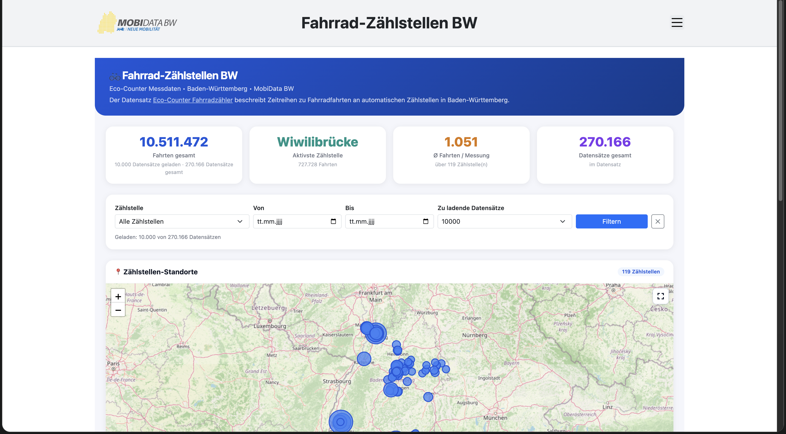
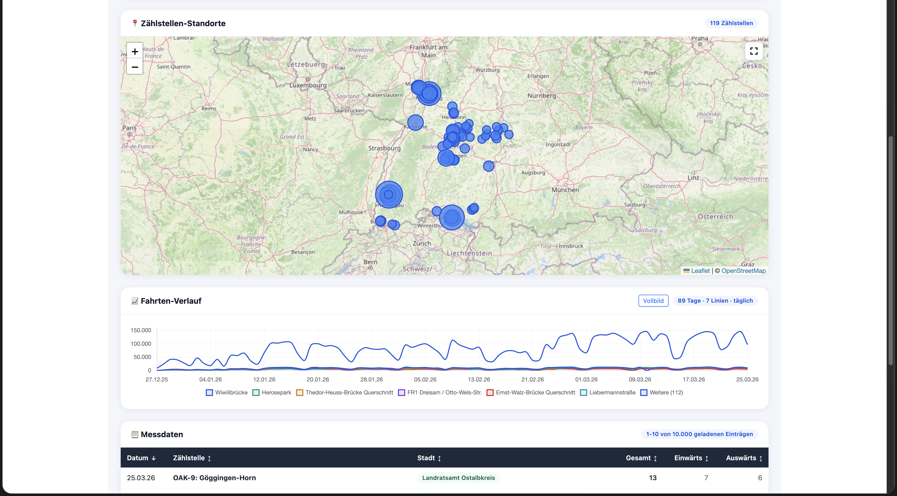
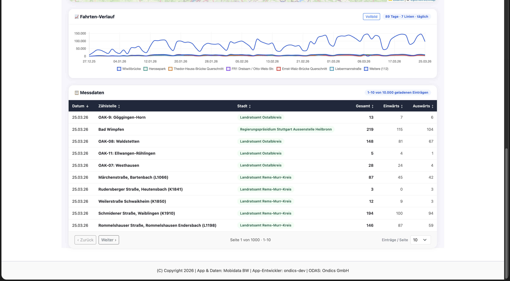

# Fahrrad-Zählstellen – App für den Open Data App-Store (ODAS)

Interaktive Visualisierung von Fahrrad-Zähldaten für den [Open Data App Store](https://open-data-app-store.de/).
Die App entspricht der [Open Data App-Spezifikation](https://open-data-apps.github.io/open-data-app-docs/open-data-app-spezifikation/).

---

## Funktionen







Single Page Application mit Fokus auf performanter Analyse und einfacher Bedienung:

- **Kennzahlen (KPIs)**: Fahrten gesamt, aktivste Zählstelle, Durchschnitt je Messung, Datensätze gesamt — mit konfigurierbaren Kontexttexten für bessere Verständlichkeit
- **Filterung**: nach Zählstelle (mit Ortsangabe) und Zeitraum (von/bis), auch nur mit Zählstelle nutzbar
- **Ladesteuerung**: Auswahl der zu ladenden Datensätze (100 bis 10000 oder `Alle`), Fortschrittsanzeige und Abbrechen-Button
- **Kartenansicht**: Leaflet-Karte mit aggregierten Zählstellenpunkten, Popups und Vollbild-Button als Karten-Control
- **Fahrten-Verlauf**: Chart.js-Zeitreihe mit Vollbildmodus, adaptiver Aggregation (Tag/Woche/Monat), Serienbündelung für große Datenmengen und Decimation
- **Messdaten-Tabelle**: Sortierung auf allen relevanten Spalten, clientseitige Pagination ohne Neuladen von Karte/Chart, Einträge-pro-Seite-Auswahl (10/25/50/100)
- **Schale 4 – Verständlichkeit**: Datenfrische-Anzeige (basierend auf neuestem Messwert), ausklappbare Methodikbox mit Datenquellen-Hinweis, automatisch abgeleitete Quell-Links (Portal/Datensatz/Ressource), optionaler Zusatz-Link-Bereich
- **Robuster Datenabruf**: CKAN-Requests über ODAS-Proxy mit Fallback-Strategie und Batch-Ladevorgängen

---

## Datenformat

Unterstützt **CKAN Datastore JSON** (Endpoint `datastore_search`) mit `result.total` und `result.records`.

---

## Kompatible Datensätze

Datensätze mit folgenden Kernfeldern (Feldnamen können im Quellsystem variieren, die App erwartet diese Inhalte):

| Feld            | Beschreibung                    |
| --------------- | ------------------------------- |
| `iso_timestamp` | Zeitstempel der Messung         |
| `counter_site`  | Name der Zählstelle             |
| `domain_name`   | Stadt/Kommune                   |
| `channels_all`  | Gesamtzahl Fahrten je Messpunkt |
| `channels_in`   | Fahrten einwärts                |
| `channels_out`  | Fahrten auswärts                |
| `latitude`      | Breitengrad der Zählstelle      |
| `longitude`     | Längengrad der Zählstelle       |

---

## Entwicklung

**Voraussetzungen:** Docker / Docker Compose, Make

```bash
make build up
```

App läuft auf http://localhost:8089 (Konfiguration wird lokal geladen).

### Wichtige Dateien

| Datei                      | Beschreibung                                                             |
| -------------------------- | ------------------------------------------------------------------------ |
| `app/app.js`               | Hauptlogik: Datenabruf, Filterung, KPIs, Tabelle, Chart, Karte, Vollbild |
| `app/index.html`           | Einstiegspunkt der App im ODAS-Container                                 |
| `app-package.json`         | App-Metadaten und Instanz-Konfigurationsparameter für ODAS               |
| `odas-config/config.json`  | Lokale Konfiguration für die Entwicklung                                 |
| `assets/odas-app-icon.svg` | App-Icon                                                                 |
| `CHANGELOG.md`             | Versionshistorie                                                         |

---

## Konfiguration (Instanz)

| Parameter                | Beschreibung                                                        | Pflicht |
| ------------------------ | ------------------------------------------------------------------- | ------- |
| `apiurls`                | URLs zu Datenressourcen. Eintrag `zaehlstellen`: Basis-URL zur CKAN Datastore API (`/api/3/action/datastore_search`) | ja (Eintrag `zaehlstellen`) |
| `resourceid`             | Resource-ID des Datensatzes                                         | ja      |
| `urlDaten`               | URL zur Datensatzseite im Open Data Portal                          | ja      |
| `kpiKontext1`–`kpiKontext4` | Optionale Erklärtexte unter den vier KPI-Kacheln                | nein    |
| `datenquelleHinweis`     | Methodik-/Datenquelle-Hinweis (Markdown/HTML, ausklappbar)          | nein    |
| `datenStand`             | Freitext-Datenstand, z.B. "Stand: Januar 2025"                      | nein    |
| `weiterfuehrendeLinks`   | Zusätzliche Links zu verwandten Datensätzen (Markdown/HTML)         | nein    |
| `titel`                  | Titel innerhalb der App                                             | ja      |
| `seitentitel`  | Browser-Tab-Titel                                                   | ja      |
| `icon`         | Logo/Icon in der Kopfzeile                                          | ja      |
| `beschreibung` | Inhalt für den Menüpunkt „Über diese App"                           | ja      |
| `kontakt`      | Kontakttext für den Menüpunkt „Kontakt"                             | ja      |
| `impressum`    | Impressumstext                                                      | ja      |
| `datenschutz`  | Datenschutztext                                                     | ja      |
| `fusszeile`    | Footer-Text                                                         | ja      |
| `lizenz`       | Lizenzangabe für die App                                            | ja      |
| `sprache`      | Sprache der App (aktuell `de`)                                      | ja      |

---

## Betriebsarten

Die App kann lokal, eigenstaendig hinter einem Traefik-Reverse-Proxy oder ueber den ODAS
betrieben werden.

**Standalone ist eingeschraenkt** und nur mit einer ausgetauschten, CORS-freigegebenen
Datenquelle moeglich — siehe den Hinweis unter „Standalone-Betrieb".

### Datenabruf: `proxyAktiv`

| Wert   | Bedeutung                                                                   |
| ------ | --------------------------------------------------------------------------- |
| `nein` | Direkter Abruf der Daten-URL. Setzt eine CORS-freigegebene Quelle voraus.    |
| `ja`   | Abruf ueber den ODAS-Proxy `…/odp-data`. Nur im ODAS-Live-System verfuegbar. |

**Diese App ist auf `ja` voreingestellt.** Die konfigurierte Datenquelle
(`mobidata-bw.de`) sendet keinen `Access-Control-Allow-Origin`-Header; ein Direktabruf aus
dem Browser wird daher blockiert. Fuer Entwicklung und Standalone-Betrieb muss
eine CORS-freigegebene Datenquelle konfiguriert und `proxyAktiv` auf `nein`
gesetzt werden.

### Standalone-Betrieb

> **Standalone ist bei dieser App eingeschraenkt.** Mit der mitgelieferten Datenquelle
> ist sie in **keiner** Standalone-Konfiguration funktionsfaehig: mit `proxyAktiv: "ja"`
> fehlt der Proxy im Container, mit `"nein"` greift die CORS-Sperre der Quelle. Der
> Standalone-Betrieb setzt deshalb zwingend eine ausgetauschte, CORS-freigegebene
> Datenquelle voraus.

Voraussetzung: ein laufender Traefik mit dem externen Docker-Netzwerk `proxynet`,
dem EntryPoint `websecure` und dem Zertifikatsresolver `letsencrypt`.

1. In `docker-compose.standalone.yml` den Platzhalter `app1.example.com` durch den
   echten FQDN ersetzen.
2. In `odas-config/config.json` `proxyAktiv` auf `nein` **setzen** — ausgeliefert
   wird `ja`. Der ODAS-Proxy `…/odp-data` steht im Standalone-Container nicht zur
   Verfuegung; die mitgelieferte `nginx.conf` kennt keinen entsprechenden
   `location`-Block.
3. Die Datenquelle (`apiurls.zaehlstellen`) auf eine CORS-freigegebene Ressource umstellen. Die
   mitgelieferte Quelle (`mobidata-bw.de`) sendet keinen
   `Access-Control-Allow-Origin`-Header und ist standalone **nicht** nutzbar.
4. Starten:

```bash
STANDALONE=true make up
STANDALONE=true make logs
STANDALONE=true make down
```

Im Standalone-Betrieb entfaellt die lokale Portfreigabe; Traefik terminiert TLS und
leitet auf den internen Nginx-Port 80 weiter. Die Konfiguration wird aus derselben
`odas-config/config.json` gelesen wie in der Entwicklung und von Nginx unter `/config`
ausgeliefert.

### Beim Aufruf kontaktierte Drittanbieter

Beim Aufruf dieser App werden folgende externe Server kontaktiert:

- `tile.openstreetmap.org` — Kartenkacheln (OpenStreetMap)

Diese Anbieter bleiben auch im Standalone-Betrieb extern; ein vollständig autarker Betrieb ohne Internetzugang ist derzeit nicht möglich. Alle Programmbibliotheken werden lokal aus `app/vendor/` ausgeliefert und nicht mehr extern geladen.

### Auslieferung an den ODAS

`make zip` erzeugt das Liefer-ZIP mit `app/`, `assets/`, `app-package.json` und
`CHANGELOG.md`. Die Infrastrukturdateien (`Dockerfile`, `docker-compose*.yml`,
`nginx.conf`, `Makefile`) sind nicht Teil der Auslieferung. Das ZIP ist ein Bauartefakt und wird nicht mitversioniert, sondern bei Bedarf mit `make zip` erzeugt.

## Autor

(C) 2026, Ondics GmbH
